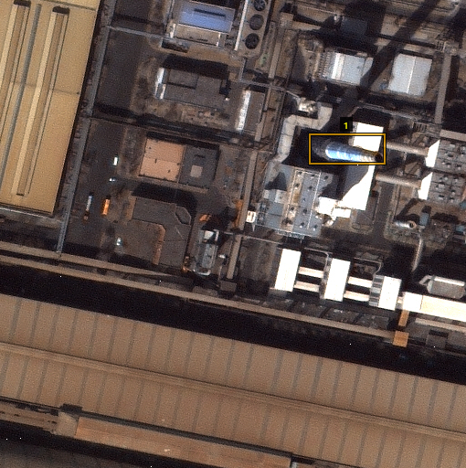
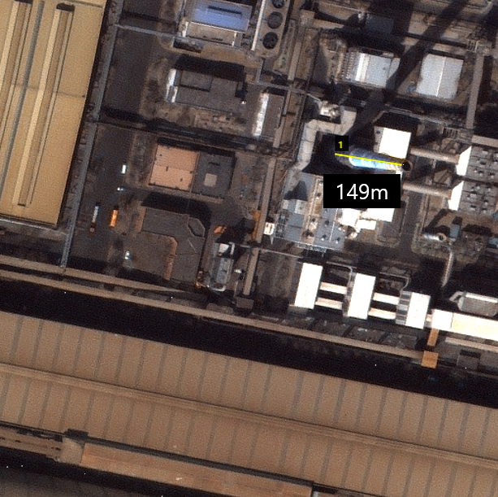
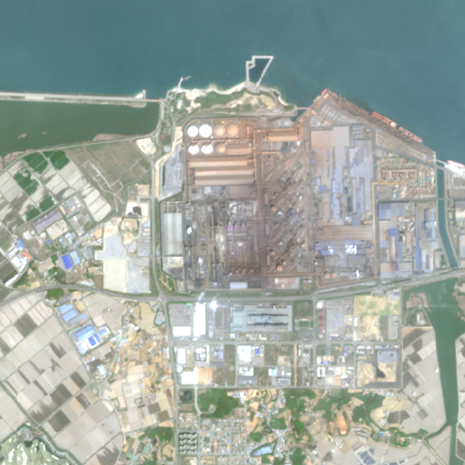
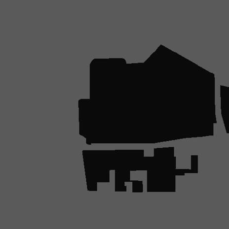

# K-ICT_DataCreatorCamp_2025

### Dataset Download
#### Download from [AIHub](https://www.aihub.or.kr/aihubdata/data/view.do?currMenu=115&topMenu=100&searchKeyword=%EB%8C%80%EA%B8%B0%EC%98%A4%EC%97%BC%20%EB%B0%B0%EC%B6%9C%EC%9B%90%20%EA%B3%B5%EA%B0%84%20%EB%B6%84%ED%8F%AC%20%EB%8D%B0%EC%9D%B4%ED%84%B0&aihubDataSe=data&dataSetSn=71805)
- for KN-CIV Only

#### Download from [GDrive](https://drive.google.com/drive/folders/1azPGaHSkf2sOA3DKE7HQUvkqSD5-S6CA?usp=sharing)
- Data: `TS_KS.zip & VS_KS.zip` (Mission 1/2), `TS_SN10_SN10.zip & VS_SN10_SN10.zip` (Mission 3)
- Label: `TL_KS_BBOX.zip & VL_KS_BBOX.zip` (Mission 1), `TL_KS_LINE.zip & VL_KS_LINE.zip` (Mission 2), `TL_SN10.zip & VL_SN10.zip` (Mission 3)


### Dataset Overview
| 구분 | 해상도 | 위성영상 | 학습데이터크기 | 형식 | 수량 (장) |
|---|---|---|---|---|---|
| 굴뚝탐지 | 1m 이하 | Kompsat 3/3A | 512×512 | JSON | 10,065 |
| 굴뚝높이 | 1m 이하 | Kompsat 3/3A | 512×512 | JSON | 10,065 |
| 산업단지 | 10m | Sentinel-2 | 512×512 | TIF | 10,000 |

#### Distributions
##### GEMS 위성영상 수집대상 분포
| 구분 | 수량 | 비율 |
|---|---|---|
| 중국 산업단지 | 8,000 | 53.33% |
| 한국 산업단지 | 2,000 | 13.33% |

##### 산업단지 분포
| 구분 | 수량 | 비율 |
|---|---|---|
| 제철제강 | 3,121 | 31.21% |
| 석유화학 | 5,799 | 57.99% |
| 발전소 | 985 | 9.85% |
| 시멘트 | 95 | 0.95% |


### Dataset Preview
#### Mission 1 (Object Detection)
```json
"shape_attributes": {'name': "rect", 'x': 336, 'y': 280, 'width': 45, 'height': 100}
```

- Metric: mAP@IoU = 0.5

#### Mission 2 (Height Estimation from Images)
```json
"region_attributes": {'chi_id': "1", 'chi_height_m': "187.28"}
```

- Unit: meter
- Metric: RMSE

#### Mission 3, 4 (Semantic Segmentation)
```json
"shape_attributes": {'name': "rect", 'x': 336, 'y': 280, 'width': 45, 'height': 100}
```


- Metric: mIoU


### Experiments
#### Mission 1 (Detectron2 ver)
- 작은 객체이므로 Transformers DETR 사용하면 성능 안나올 것
- Detectorn2의 SwinT + Faster RCNN 프리트레인 불러와서 파인튜닝하는 방식으로

#### Mission 1 (Transformers ver)
- 근데 문제는 프리트레인 모델을 가져다 쓴다 생각하면 최신 SOTA 성능을 찍어둔걸 쓰는게 더 좋을수도
- RT-DETR 모델로 학습할 때는 640x640으로 하고, 추론할 때는 896x896 정도로 높여서 추론하면
- 작은 물체 감지 성능이 올라갈 수도? (구현이 간단하니 이거 먼저 해봐야지)

#### Mission 2 (Transformers ver)
- Transformers DINOv3 + 커스텀 리니어레이어
- Mission 1의 모델의 BBOX를 사용하는 TwoStage 방식으로
- 원본 이미지와 BBOX 영역을 Crop한 이미지를 Fusion하여 리니어레이어로 높이 추정

#### Mission 3 (Transformers ver)
- Segmentation에는 SwinT + UperNet 기반 모델이 성능이 높을 것으로 보임
- UperNetForSemanticSegmentation 프리트레인 파인튜닝해 사용하거나
- SegFormer-B2도 비교 실험 진행


---

### Insights
- 대회에서 지정한 데이터셋이 난이도가 그다지 높지 않고, 데이터셋의 수가 적어 CNN 계열의 모델들이 성능 상으로 높은 우위를 가짐
